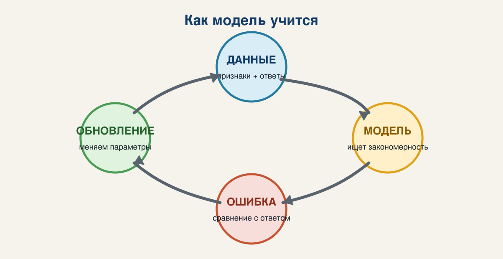
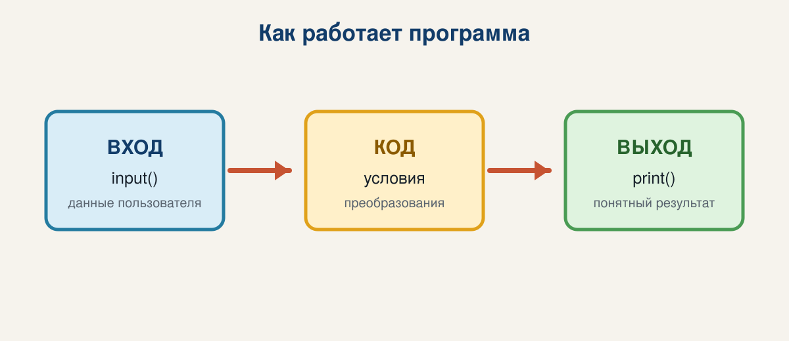
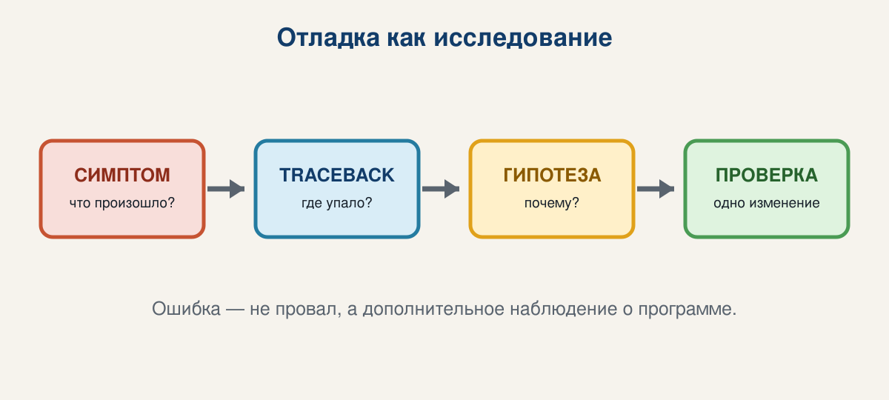
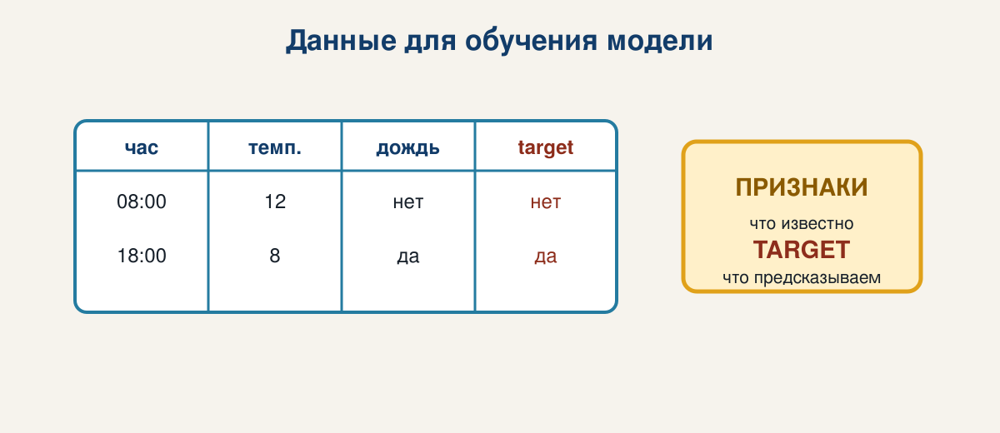

# Что будет к концу семестра



- писать небольшие программы на Python;
- понимать данные, признаки и target;
- обучать и проверять ML-модели;
- визуализировать результаты;
- дойти до простой нейросети и RNN.

**Главная привычка курса:** каждый результат можно запустить, проверить и объяснить.

---

# Маршрут сегодняшней встречи

1. Что такое программа и алгоритм
2. Как компьютер получает вход и выдает результат
3. Первые значения и переменные Python
4. Условия и простая логика
5. Как читать ошибки
6. Мини-практика: отчет о наблюдениях

**Ритм:** посмотрели → предсказали результат → запустили → изменили код.

---

# Любая программа — это pipeline



```text
входные данные  ->  преобразование  ->  результат
     input              код              output
```

Пример из жизни:

```text
температура в C -> перевод в F -> число на экране
```

То же мышление понадобится в ML:

```text
признаки -> модель -> предсказание
```

---

# Алгоритм до кода

Задача: решить, достаточно ли наблюдений.

```text
1. Получить имя набора
2. Получить количество наблюдений
3. Если количество >= 10:
       вывести «достаточно данных»
   Иначе:
       вывести «нужно больше данных»
```

Алгоритм должен быть:

- конечным;
- однозначным;
- проверяемым на примерах.

---

# Первая программа

```python
name = "weather"
observations = 12

print(name)
print(observations)
```

Переменная — это имя, по которому мы обращаемся к значению.

Попробуйте предсказать вывод до запуска:

```python
score = 8
score = score + 2
print(score)
```

<div class="tag">Сначала прогноз. Потом запуск.</div>

---

# Четыре типа, которых достаточно сегодня

```python
name = "weather"       # str: текст
observations = 12       # int: целое число
average = 21.5          # float: дробное число
enough = True           # bool: да или нет
```

Проверить тип можно так:

```python
print(type(average))
```

Тип важен, потому что операции над текстом и числами различаются.

---

# Ввод всегда начинается со строки

```python
name = input("Название набора: ")
observations = int(input("Количество наблюдений: "))
score = float(input("Средний показатель: "))

print(name, observations, score)
```

`input()` возвращает текст. Преобразование `int()` или `float()` говорит Python, как его интерпретировать.

**Мини-эксперимент:** что произойдет, если убрать `int()`?

---

# Условия: код выбирает ветку

```python
observations = 12

if observations >= 10:
    status = "достаточно данных"
else:
    status = "нужно больше данных"

print(status)
```

Обратите внимание на:

- `>=` — сравнение;
- двоеточие после условия;
- отступ внутри ветки;
- `else` для альтернативы.

---

# Соберем мини-программу

```python
name = input("Название набора: ").strip()
observations = int(input("Количество наблюдений: "))
score = float(input("Показатель: "))

if not name:
    print("Ошибка: имя не может быть пустым")
elif observations < 0:
    print("Ошибка: количество не может быть отрицательным")
else:
    if observations >= 10:
        status = "достаточно данных"
    else:
        status = "нужно больше данных"
    print(f"Набор {name}: {score:.2f}; {status}")
```

Это уже маленький, но настоящий data pipeline.

---

# Ошибка — это сообщение о гипотезе



### Три частых вида

- **SyntaxError:** Python не понял структуру кода.
- **RuntimeError:** программа сломалась во время выполнения.
- **Логическая ошибка:** программа работает, но отвечает неверно.

Алгоритм отладки:

1. Прочитать последнюю строку traceback.
2. Найти строку, где возникла проблема.
3. Проверить типы и промежуточные значения.
4. Исправить одну гипотезу и запустить снова.

---

 # Что такое машинное обучение?

 Машинное обучение — способ находить закономерность в примерах и использовать ее для новых данных.

 ```text
 примеры с ответами -> алгоритм обучения -> модель
 новые признаки     -> модель           -> предсказание
 ```

 В обычной программе правило пишем мы. В ML правило подбирается по данным, но проверять его все равно должны мы.

 

 <div class="tag">Модель не «понимает» задачу сама: она оптимизирует выбранный нами критерий.</div>

 ---

 # Пример: признаки и target

 Представим задачу: предсказать, будет ли дождь.

 

 - **Признаки (`X`)** — то, что известно до предсказания.
 - **Target (`y`)** — правильный ответ, который хотим предсказать.
 - Одна строка — один объект или один момент наблюдения.

 Если target случайно попадет в признаки, модель получит подсказку и оценка станет нечестной.

 ---

 # Два режима обучения

 <div class="columns">
 <div class="panel">

 ### С учителем

 У каждого примера есть ответ `y`.

 ```text
 X = [температура, давление]
 y = дождь / нет
 ```

 Задачи: классификация и регрессия.

 </div>
 <div class="panel">

 ### Без учителя

 Ответов нет — ищем структуру.

 ```text
 X = [рост, вес, возраст]
 y = отсутствует
 ```

 Задача: например, кластеризация.

 </div>
 </div>

 Сегодня достаточно запомнить: тип задачи определяется тем, есть ли правильные ответы.

 ---

 # Как модель ошибается

 Модель строит предсказание `y_hat` и сравнивает его с правильным ответом `y`.

 ```python
 y_true = [1, 0, 1, 1]
 y_pred = [1, 1, 1, 0]

 mistakes = sum(
     true != predicted
     for true, predicted in zip(y_true, y_pred)
 )
 accuracy = 1 - mistakes / len(y_true)
 print(accuracy)  # 0.5
 ```

 `accuracy` — доля правильных ответов. Метрика не является «оценкой интеллекта» модели: она зависит от задачи и набора данных.

 ---

 # Baseline: сначала простое правило

 До сложной модели нужен ориентир.

 ```python
 def majority_class(labels):
     counts = {}
     for label in labels:
         counts[label] = counts.get(label, 0) + 1
     return max(counts, key=counts.get)

 train_labels = ["yes", "no", "yes", "yes"]
 baseline = majority_class(train_labels)
 print(baseline)  # yes
 ```

 Если сложная модель не лучше baseline на новых данных, сложность не оправдана.

 ---

 # Train и test: честная проверка

 ```python
 from random import Random

 data = list(range(10))
 Random(42).shuffle(data)

 split = int(len(data) * 0.8)
 train = data[:split]
 test = data[split:]

 print(train)
 print(test)
 ```

 - `train` — примеры, по которым модель учится;
 - `test` — новые примеры для финальной проверки.

 Нельзя подбирать решение, разглядывая test снова и снова.

 ---

 # От правила к обучаемому правилу

 Ручное правило:

 ```python
 if observations >= 10:
     result = "enough"
 ```

 Упрощенная обучаемая модель:

 ```python
 def predict(observations, threshold):
     return observations >= threshold

 for threshold in [5, 10, 15]:
     predictions = [predict(value, threshold) for value in [3, 12, 20]]
     print(threshold, predictions)
 ```

 В ML алгоритм может подобрать `threshold` по примерам. Но выбор метрики и проверка качества остаются нашей ответственностью.

---

# Live coding: меняем программу

Начнем с этого:

```python
observations = 12
```

Потом по очереди попробуем:

- `observations = 10`;
- `observations = 9`;
- `observations = -1`;
- пустое имя;
- текст вместо числа.

После каждого запуска ответьте:

1. Что я ожидал?
2. Что произошло?
3. Какое правило программы это объясняет?

---

# Практика на занятии

Создайте `hello_ml.py` — программу «проверка наблюдения».

**Вход:** имя, количество наблюдений, числовой показатель.

**Выход:** отчет и сообщение:

- от 10 наблюдений: `достаточно данных`;
- меньше 10: `нужно больше данных`.

**Обязательно:** обработать пустое имя или отрицательное количество.

Проверить три сценария:

1. обычный;
2. граничный: ровно 10;
3. ошибочный.

---

# Exit ticket

Перед уходом ответьте письменно в 3–5 предложениях:

- чем значение отличается от переменной;
- почему `input()` требует преобразования;
- где в программе находятся вход, преобразование и выход;
- какую ошибку сегодня удалось найти;
- что было самым непонятным.

<div class="tag">Ошибки и вопросы — часть учебного результата.</div>

---

# После встречи

1. Доделать `hello_ml.py`.
2. Добавить `README.md` с командой запуска и двумя примерами.
3. Сделать первый Git commit.
4. Принести один вопрос на следующую встречу.

Следующая тема: функции, циклы, коллекции и Git.

---

# Источники изображений

Изображения используются как визуальные иллюстрации и загружаются из Unsplash Source через `images.unsplash.com`.

- Unsplash: https://unsplash.com/
- Marp: https://marp.app/
- Python documentation: https://docs.python.org/3/tutorial/
